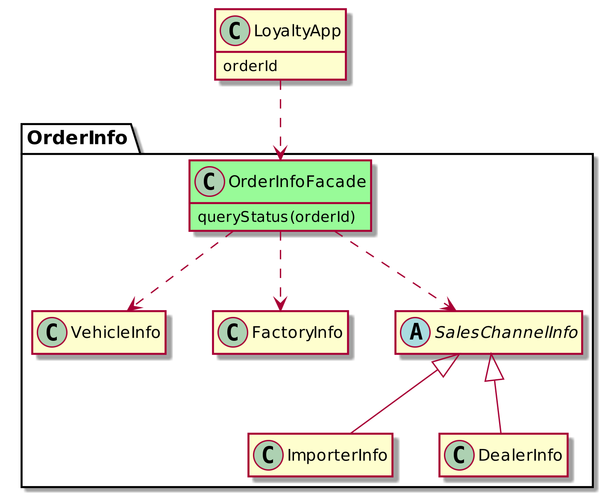
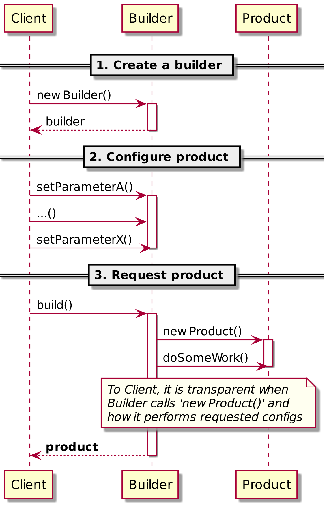

# FacadePattern
Java code and PlantUML diagrams that illustrate the "Facade" Design Pattern (+ Builder Pattern bonus)

> This app was created with :heart: for a lecture at HWR Berlin, 22 June 2021.
> It's only purpose is to illustrate the "Facade" Design Pattern and a simple Java implementation.
> This is not production code.

## Contents
### [com/logicloop](com/logicloop/)
Holds the Java example to illustrate how Facade is used. `main()` is located in [LoyaltyApp.java](com/logicloop/LoyaltyApp/LoyaltyApp.java).
There is no serious business logic implemented behind the facade, since the purpose of this code is to demonstrate the pattern principle.

Implements the following UML class diagram:

### [out](out/)
.png files generated with [PlantUML](https://plantuml.com/). Illustrate the "Facade" pattern with an UML class diagram (see above).

As a bonus, there is also an UML sequence diagram to illustrate the "Builder" Design Pattern:

Note that this is a simplified diagram, for example it omits the "Director" class.

### [plantuml](plantuml/)
PlantUML source files that were used to generate .png files.

🤓 There is a freely avaliable [PlantUML Online Server](http://www.plantuml.com/plantuml/uml/).
